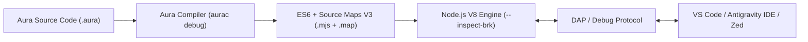

# Aura Language Debugging Guide

This guide covers interactive debugging for Aura Language (`.aura`) applications across **VS Code**, **Antigravity IDE**, **Zed**, and the **Command Line (CLI)**.

---

## 1. Overview & Debugging Architecture

Aura features full Source Maps V3 generation, enabling:
- **Direct Source Breakpoints**: Set breakpoints directly in `.aura` files.
- **Accurate Stack Traces**: Runtime exceptions and panics display `.aura` file names and line numbers.
- **Variable Inspection & Watches**: Inspect local variables, struct fields, channel buffers, and function parameters.
- **Step-by-Step Execution**: Step Over (`F10`), Step Into (`F11`), Step Out (`Shift+F11`), and Continue (`F5`).



---

## 2. Debugging in VS Code & Antigravity IDE

Both **VS Code** and **Antigravity IDE** share the official Aura extension (`aura-vscode` / `aura-antigravity`).

### 1-Click Debugging
1. Open any `.aura` file (e.g., `main.aura`).
2. Click the gutter margin next to any line number to set a **Breakpoint** (red dot).
3. Click the **Debug Icon** `$(debug-alt)` in the editor title bar (next to Run), or press **`F5`**.
4. The extension will:
   - Automatically compile the `.aura` file with Source Maps.
   - Launch the integrated debugger session.
   - Stop at your breakpoint directly inside the `.aura` file.

### Custom Debug Configurations (`.vscode/launch.json`)

If you want custom arguments, environment variables, or launch profiles, create `.vscode/launch.json`:

```json
{
  "version": "0.2.0",
  "configurations": [
    {
      "type": "aura",
      "request": "launch",
      "name": "Debug Aura: Active File",
      "program": "${file}",
      "args": ["--verbose"],
      "stopOnEntry": false,
      "sourceMaps": true
    },
    {
      "type": "aura",
      "request": "attach",
      "name": "Attach to Aura Process",
      "port": 9229,
      "address": "127.0.0.1"
    }
  ]
}
```

---

## 3. Debugging in Zed Editor

Zed supports debugging via the **Debug Adapter Protocol (DAP)** and task runners.

### Using Zed Tasks (`.zed/tasks.json`)

1. Open your `.aura` file in Zed.
2. Open the Command Palette (`Cmd + Shift + P` on macOS, `Ctrl + Shift + P` on Linux) and type:
   **`task: spawn`**
3. Select **`Aura: Debug Active File (Listen 9229)`**.
4. Aura will compile with high-precision Source Maps and launch the V8 inspector:
   ```bash
   aurac debug $ZED_FILE --brk
   ```

### Using Zed Launch Configurations (`.zed/launch.json`)

Configure `.zed/launch.json` in your workspace root:

```json
{
  "version": "0.2.0",
  "configurations": [
    {
      "name": "Debug Aura Active File",
      "type": "node",
      "request": "launch",
      "program": "${file}",
      "runtimeExecutable": "aurac",
      "runtimeArgs": ["debug", "--brk"],
      "port": 9229,
      "sourceMaps": true
    },
    {
      "name": "Attach to Aura Debugger (Port 9229)",
      "type": "node",
      "request": "attach",
      "port": 9229,
      "address": "127.0.0.1",
      "sourceMaps": true
    }
  ]
}
```

---

## 4. Interactive Step-by-Step Debugging (`aurac step` / `aurac debug --step`)

Aura includes a native, interactive Step Debugger that runs directly in any terminal (including VS Code, Antigravity IDE, and Zed integrated terminals):

```bash
# Start interactive step debugger directly on any .aura file
aurac step examples/defer_demo.aura

# Alternatively using the debug command with the --step flag:
aurac debug examples/defer_demo.aura --step
```

### Features:
- **Zero-Plumbing Stepping**: Automatically skips internal compiler helpers (like defer runtime wrappers, panic handlers, and Node internals). Every step pauses directly on original `.aura` source code lines.
- **Visual Source Context**: Highlights the active line with `➜`, displays source lines before/after, and marks active breakpoints with `●`.
- **Full Call Stack Backtrace**: View callers and frames mapped directly to `.aura` filenames and line numbers.

### Step Debugger Command Reference:

| Command | Shortcuts | Description |
| :--- | :--- | :--- |
| `next` | `n`, `step`, `<ENTER>` | **Step Over**: Advance to the next line in the current function. Pressing `<ENTER>` repeats the previous step. |
| `into` | `s`, `into` | **Step Into**: Step directly into the function being invoked. |
| `out` | `o`, `finish` | **Step Out**: Run until current function returns back to its caller. |
| `continue` | `c` | **Continue**: Resume program execution until the next breakpoint or termination. |
| `break <line>` | `b <line>` | **Toggle Breakpoint**: Set or remove a breakpoint at the given `.aura` line. |
| `print <expr>` | `p <expr>` | **Evaluate Expression**: Evaluate variable or expression on active frame. |
| `locals` | `vars` | **Inspect Variables**: Display all local variables and their values in current scope. |
| `backtrace` | `bt`, `stack` | **Call Stack**: Display the mapped call stack backtrace with function names and line numbers. |
| `list` | `l` | **Show Source**: Re-display source lines around the current position. |
| `help` | `h` | **Help**: Print command cheat-sheet. |
| `quit` | `q`, `exit` | **Quit**: Stop debugging session and terminate process. |

### Example Step Debugger Session:

```
⚡ Aura Interactive Step Debugger
Target file: /path/to/defer_demo.aura
Type 'h' for command help, ENTER to step over.

📍 [defer_demo.aura:28] in main()
      27 | export fn main(): Unit => {
  ➜   28 |     println("--- Starting Defer Demo ---");
      29 |     let res1 = simulateDatabaseQuery();
      30 |     println(`Result 1: ${res1}`);

(aura-dbg) n
--- Starting Defer Demo ---

📍 [defer_demo.aura:29] in main()
      28 |     println("--- Starting Defer Demo ---");
  ➜   29 |     let res1 = simulateDatabaseQuery();
      30 |     println(`Result 1: ${res1}`);

(aura-dbg) s

📍 [defer_demo.aura:4] in simulateDatabaseQuery()
       3 | export fn simulateDatabaseQuery(): String => {
  ➜    4 |     println("1. Connecting to database pool...");
       5 |     defer println("4. Database connection released (defer 1 - LIFO last)");

(aura-dbg) vars
Local Variables:
  (no user variables defined yet in this scope)

(aura-dbg) bt
Call Stack:
  #0 simulateDatabaseQuery() at examples/defer_demo.aura:4
  #1 main() at examples/defer_demo.aura:29

(aura-dbg) c
1. Connecting to database pool...
2. Beginning transaction...
>> Executing SQL: SELECT * FROM users
3. Transaction committed / closed (defer 2 - LIFO first)
4. Database connection released (defer 1 - LIFO last)
Result 1: Query executed successfully
— Program finished successfully —
```

---

## 5. Debugging via Command Line Server (`aurac debug`)

You can also launch a headless debug server to attach external debuggers:

```bash
# Compile and pause at entrypoint, listening on port 9229
aurac debug src/main.aura

# Use a custom port
aurac debug src/main.aura --port 9300

# Run without pausing at entrypoint (attach when needed)
aurac debug src/main.aura --no-brk

# Use custom build tags
aurac debug src/main.aura --tags "dev,auth"
```

Once running, you can connect from:
- **Chrome DevTools**: Open `chrome://inspect` in Google Chrome and click **Inspect**.
- **VS Code / Antigravity**: Use the **"Attach to Aura Process"** configuration.
- **Zed / Neovim / Any DAP client**: Attach to `127.0.0.1:9229`.

---

## 6. Source Map Verification

To verify that sourcemaps are functioning accurately on any file:

```bash
# Compile with source map output
aurac compile src/main.aura -o dist/main.js

# Inspect the generated source map
cat dist/main.js.map
```

When running `aurac run`, Node automatically runs with `--enable-source-maps`, ensuring runtime panics and uncaught exceptions translate directly to the corresponding `.aura` lines.
