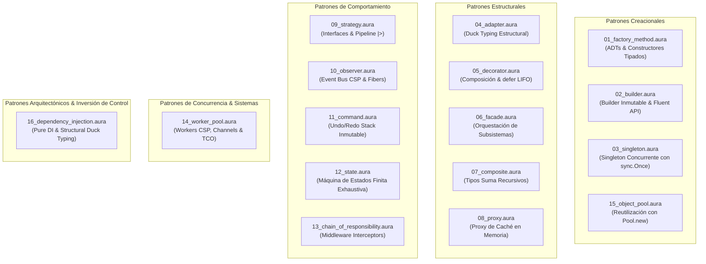

# 🏛️ Patrones de Diseño en Aura Language (`aurac`)

Colección exhaustiva y ejecutable de **Patrones de Diseño de Software** (Gang of Four y Sistemas Concurrentes Modernos) implementados idiomáticamente en **Aura Language**.

---

## 🌟 Paradigma de Aura vs. POO Tradicional

A diferencia de lenguajes orientados a objetos clásicos (Java, C++, C#) donde los patrones requieren extensas jerarquías de clases abstractas, mutabilidad y métodos virtuales, **Aura** reimagina estos patrones combinando:

| Concepto en POO Tradicional | Enfoque Idiomático en Aura Lang | Beneficio Clave |
| :--- | :--- | :--- |
| **Jerarquías de Clases y Subtipos** | **Tipos Suma Algebraicos (ADTs)** con Pattern Matching | Exhaustividad garantizada en compilación; sin estados nulos o inválidos. |
| **Palabra clave `implements`** | **Duck Typing Estructural (Interfaces Implícitas)** | Acoplamiento mínimo; cualquier registro satisface la interfaz si posee los métodos. |
| **Mutación de Estado en Objetos** | **Inmutabilidad por Defecto** y Actualizaciones Funcionales (`...base`) | Ausencia de efectos secundarios no deseados; libre de *data races*. |
| **Hilos pesados del SO y Locks manuales** | **Concurrencia CSP (Fibers M:N, Canales y `sync.Once`)** | Millones de tareas concurrentes con bajo consumo de memoria y sin bloqueos muertos. |
| **Objetos Envolventes para Algoritmos** | **Funciones de Primera Clase y Pipelines (`\|>`)** | Composición declarativa y limpia sin clases innecesarias. |
| **Try-Finally para Liberación de Recursos** | **Sentencias `defer` LIFO deterministas** | Limpieza garantizada al abandonar el ámbito de la función. |

---

## 📐 Mapa de la Suite de Patrones



---

## 📋 Catálogo Completo de Patrones

| # | Archivo | Patrón | Categoría | Conceptos de Aura Destacados |
| :-: | :--- | :--- | :--- | :--- |
| **01** | [`01_factory_method.aura`](file:///Users/mavro/Projects/aura-lang/examples/design_patterns/01_factory_method.aura) | **Factory Method** | Creacional | ADTs (`Email`, `SMS`, `Slack`, `Webhook`), constructores tipados y pattern matching exhaustivo. |
| **02** | [`02_builder.aura`](file:///Users/mavro/Projects/aura-lang/examples/design_patterns/02_builder.aura) | **Builder** | Creacional | Fluent API inmutable, spread de registros (`{ ...current, port: p }`), validaciones con `Result<T, E>`. |
| **03** | [`03_singleton.aura`](file:///Users/mavro/Projects/aura-lang/examples/design_patterns/03_singleton.aura) | **Singleton Concurrente** | Creacional | Primitiva nativa `Once.new()` (`sync.Once`), inicialización atómica segura ante múltiples fibers simultáneos. |
| **04** | [`04_adapter.aura`](file:///Users/mavro/Projects/aura-lang/examples/design_patterns/04_adapter.aura) | **Adapter** | Estructural | Structural Duck Typing: adaptación de API legacy XML a interfaz moderna `PaymentProcessor` sin herencia. |
| **05** | [`05_decorator.aura`](file:///Users/mavro/Projects/aura-lang/examples/design_patterns/05_decorator.aura) | **Decorator** | Estructural | Composición de interfaces, funciones de orden superior y medición de latencia / logging con `defer` LIFO. |
| **06** | [`06_facade.aura`](file:///Users/mavro/Projects/aura-lang/examples/design_patterns/06_facade.aura) | **Facade** | Estructural | Orquestación limpia de 4 subsistemas (Inventario, Pagos, Logística, Notificaciones) con `Result<T, E>`. |
| **07** | [`07_composite.aura`](file:///Users/mavro/Projects/aura-lang/examples/design_patterns/07_composite.aura) | **Composite** | Estructural | ADT recursivo (`File \| Directory`), operaciones de cálculo de tamaño, conteo y renderizado de árbol uniforme. |
| **08** | [`08_proxy.aura`](file:///Users/mavro/Projects/aura-lang/examples/design_patterns/08_proxy.aura) | **Proxy de Caché** | Estructural | Intercepción de llamadas sobre la interfaz `WeatherService`, control de cache hits/misses en memoria con `Map`. |
| **09** | [`09_strategy.aura`](file:///Users/mavro/Projects/aura-lang/examples/design_patterns/09_strategy.aura) | **Strategy** | Comportamiento | Dos estilos: Estrategia polimórfica vía Interfaces y Estrategia funcional pura con el operador Pipeline (`\|>`). |
| **10** | [`10_observer.aura`](file:///Users/mavro/Projects/aura-lang/examples/design_patterns/10_observer.aura) | **Observer (Pub-Sub CSP)** | Comportamiento | Bus de eventos asíncrono con canales tipados (`Channel<DomainEvent>`), observadores en fibers (`spawn`) y `WaitGroup`. |
| **11** | [`11_command.aura`](file:///Users/mavro/Projects/aura-lang/examples/design_patterns/11_command.aura) | **Command** | Comportamiento | Acciones como variantes de un tipo suma (`AppendText`, `ClearText`, `ReplaceAll`) con pila de historial LIFO y soporte completo para Undo. |
| **12** | [`12_state.aura`](file:///Users/mavro/Projects/aura-lang/examples/design_patterns/12_state.aura) | **State (FSM)** | Comportamiento | Máquina de estados finita donde cada estado contiene sus propios datos; imposibilita transiciones ilegales en tiempo de compilación. |
| **13** | [`13_chain_of_responsibility.aura`](file:///Users/mavro/Projects/aura-lang/examples/design_patterns/13_chain_of_responsibility.aura) | **Chain of Responsibility** | Comportamiento | Pipeline de middlewares interceptores (Auth -> RateLimiter -> Validator -> Endpoint) con aborto temprano. |
| **14** | [`14_worker_pool.aura`](file:///Users/mavro/Projects/aura-lang/examples/design_patterns/14_worker_pool.aura) | **Worker Pool** | Concurrencia | Concurrencia masiva estilo Go con N workers concurrentes, canales con búfer, recolector y bucles recursivos con optimización TCO. |
| **15** | [`15_object_pool.aura`](file:///Users/mavro/Projects/aura-lang/examples/design_patterns/15_object_pool.aura) | **Object Pool** | Creacional/Perf | Reutilización eficiente de buffers de memoria pesados utilizando la primitiva nativa `Pool.new(...)` del runtime de Aura. |
| **16** | [`16_dependency_injection.aura`](file:///Users/mavro/Projects/aura-lang/examples/design_patterns/16_dependency_injection.aura) | **Dependency Injection (IoC)** | Arquitectura | Inversión de Control idiomática tipo Go/Rust: Pure DI por constructor, interfaces duck typing, desacoplamiento de capas y mocks para testing. |

---

## 🚀 Guía de Ejecución

### 1. Ejecutar la Suite Completa

Puedes ejecutar todos los 15 patrones secuencialmente con el script de automatización:

```bash
./examples/design_patterns/run_all.sh
```

### 2. Ejecutar un Patrón Individual

Usa la herramienta oficial `aurac run`:

```bash
# Patrón Factory Method
aurac run examples/design_patterns/01_factory_method.aura

# Patrón Builder Inmutable
aurac run examples/design_patterns/02_builder.aura

# Patrón Observer Concurrente
aurac run examples/design_patterns/10_observer.aura

# Patrón Worker Pool CSP
aurac run examples/design_patterns/14_worker_pool.aura
```

### 3. Verificación Estática de Tipos (Fast Type Check)

Verifica que el código cumpla la inferencia Hindley-Milner bidireccional sin generar código:

```bash
aurac check examples/design_patterns/01_factory_method.aura
```

### 4. Compilación a Binario Autónomo de Alto Rendimiento (Mach-O / ELF)

Compila cualquiera de los patrones directamente a un binario nativo independiente con cero dependencias externas:

```bash
aurac build examples/design_patterns/14_worker_pool.aura -o worker-pool-bin
./worker-pool-bin
```

---

## 💡 Ejemplos Resaltados de Implementación

### 1. Concurrencia CSP en el Patrón Observer
En lugar de callbacks bloqueantes en el mismo hilo, los observadores corren en fibers independientes comunicados por canales:
```aura
spawn {
    let msg = <-analyticsObserverCh;
    match msg {
        Some(ev) => println(`📊 [Observer-Analytics] ${ev.topic} a las ${ev.timestamp}`),
        None => ()
    };
    wg.done();
};
```

### 2. Garantía LIFO en el Patrón Decorator
El uso de `defer` asegura que el registro de salida y la medición de tiempos ocurran de forma infalible:
```aura
getUser: (userId: String): String => {
    println(`   📋 [LOGGING] >> Invocando getUser('${userId}')`);
    defer println(`   📋 [LOGGING] << Finalizado getUser('${userId}')`);
    inner.getUser(userId)
}
```

### 3. Pipeline Funcional en el Patrón Strategy
Composición fluida de algoritmos sin instanciar clases de contexto:
```aura
let finalPrice = basePrice
    |> applyCouponTenPercent
    |> applyVipExtraFive
    |> applyStandardShipping;
```
